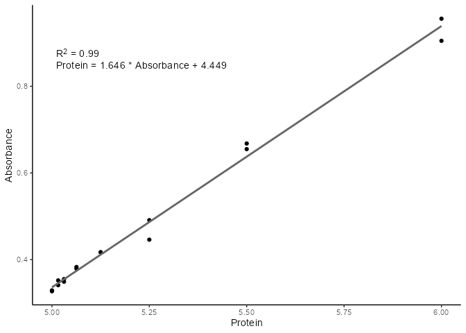
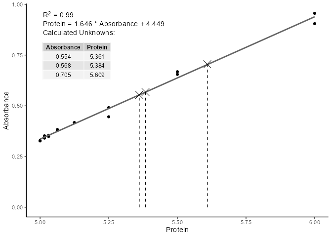

<!-- README.md is generated from README.Rmd. Please edit that file -->

# standard

<!-- badges: start -->

[](https://lifecycle.r-lib.org/articles/stages.html#experimental)
[](https://CRAN.R-project.org/package=standard)
<!-- badges: end -->

The goal of standard is to …

## Installation

Currently no published on CRAN, but install from GitHub with the
following:

``` r
remotes::install_github("rforbiochemists/standard")
```

## Example

This is a basic example which shows you how to solve a common problem:

``` r
library(standard)

# Protein Concentrations
prot <- c(0.000, 0.016, 0.031, 0.063, 0.125, 0.250, 0.500, 1.000, 
          0.000, 0.016, 0.031, 0.063, 0.125, 0.250, 0.500, 1.000) 

# Absorbance from my protein assay
abs <- c(0.329, 0.352, 0.349, 0.379, 0.417, 0.491, 0.668, 0.956, 
         0.327, 0.341, 0.355, 0.383, 0.417, 0.446, 0.655, 0.905)

data <- data.frame(
  Protein = prot + 5, 
  Absorbance = abs
)

unknowns <- c(0.554, 0.568, 0.705)

mod <- data %>% 
  std_curve_fit(Protein, Absorbance)

plot(mod)
```



``` r
std_curve_predict(mod, unknowns) %>% 
  plot()
```


